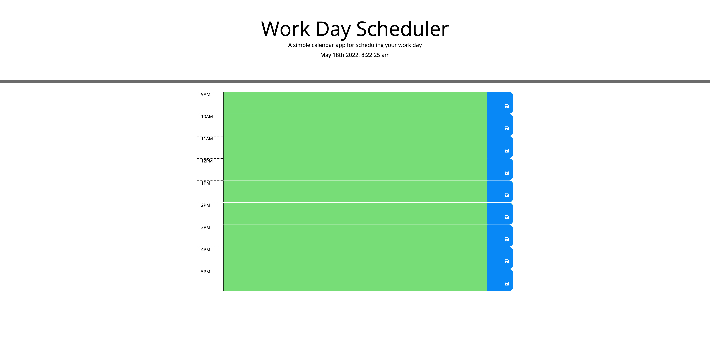

# 05 Third-Party APIs: Work Day Scheduler

## Table of Contents

- [Description](#description)
- [Installation](#installation)
- [User Story](#user_story)
- [Screenshot](#screenshot)
- [Languages](#languages)
- [License](#license)
- [Contact](#contact)

## Description

Create a simple calendar application that allows a user to save events for each hour of the day by modifying starter code. This app will run in the browser and feature dynamically updated HTML and CSS powered by jQuery. Uses moment.js.

## Installation

Runs in browser.

## User Story

AS AN employee with a busy schedule
I WANT to add important events to a daily planner
SO THAT I can manage my time effectively

## Screenshot

## Languages

CSS, Javascript, HTML

## License

MIT

## Testing

none

## Contact:

ShawnArgent (https://github.com/ShawnArgent)  
 kshawn001@gmail.com
